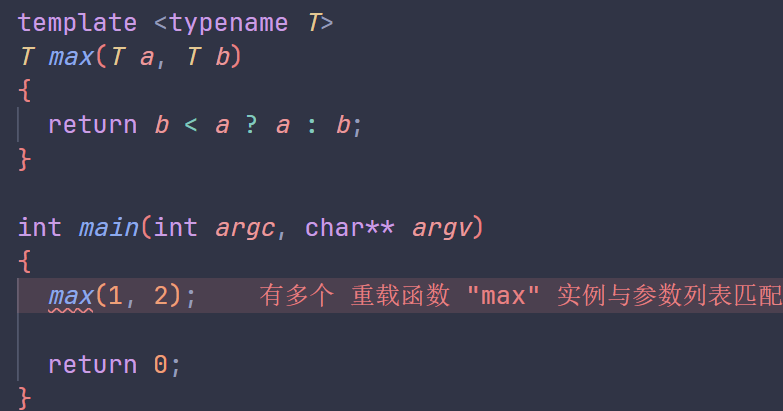

# 1.函数模板

## 1.1.初识函数模板

一组由编译器生成的函数(a family of funtion)， 未指定的参数为参数化信息

### 1.1.1.定义模板

一个返回最大值的函数模板

```cpp
template <typename T>
T max(T a, T b)
{
  return b < a ? a : b;
}
```

- T为模板参数，一个未知的类型，T为惯用名，标准库通常使用_Tp(libstdc++、libcxx)，_Ty(msvc stl)

- 由于历史原因，此处的keyword `typename`等价于`class`，用于声明类型

- 额外地，类型T在此处必须支持`operator<`，以支持代码中的三目运算符，可以使用`enable_if`对类型T施加简单约束

> [!NOTE]
> 在C++17前要求类型至少T可被拷贝构造，在C++17之后由于[复制消除和返回值优化](https://en.cppreference.com/w/cpp/language/copy_elision)，即使类型T的拷贝和移动构造函数均无效，仍然可正确传递值

### 1.1.2.使用模板

使用函数模板max

```cpp
int main()
{
  int i = 42;
  std::cout << "max(7,i):   " << ::max(7,i) << '\n';

  double f1 = 3.4;
  double f2 = -6.7;
  std::cout << "max(f1,f2): " << ::max(f1,f2) << '\n';

  std::string s1 = "mathematics";
  std::string s2 = "math";
  std::cout << "max(s1,s2): " << ::max(s1,s2) << '\n';
}
```

- 使用::是为了寻找到全局`namespace`中的`max`，也就是我们所编写的`max`函数模板生成的实例。倘若`using namespace std;`直接调用会发生名字冲突



程序输出：

```bash
max(7,i): 42
max(f1,f2): 3.4
max(s1,s2): mathematics
```

编译器不会生成所有类型的实体，只会生成所使用不同类型的不同实体

```cpp
// for type int
template <>
int max(int a, int b)
{
  return b < a ? a : b;
}
```

类似地,`max()`的其他调用实例化了`double`和`std::string`的`max`模板

```cpp
double max(double a, double b);
std::string max(std::string a, std::string b);
```

如果代码有效，`void`也是有效模板参数

```cpp
template <typename T>
T foo(T*)
{
}

void* vp = nullptr;
foo(vp); // deduces void foo(void*)
```

### 1.1.3.两阶段翻译

- 第一阶段模板定义：对独立的成员(不依赖于模板参数)进行检查
  - 现语法错误，如缺少逗号
  - 未知名称
  - 独立的静态断言
- 第二段模板实例化：检查非独立的成员

```cpp
template <typename T>
class A
{
public:
  void add()
  {
    printf("A add\n");
  }
};

template <typename T>
class B : public A<T>
{
public:
  void cal()
  {
    add();       // 此处报错，第一阶段查找时，add()定性为独立，认为它是非成员变量，但又找不到
    this->add(); // 此处正确，第一阶段认为它是非独立（因为与this有关，即与Ｔ有关）
                 // 第二阶段查找时，Ｂ中找不到，则在基类Ａ中能找到
  }
};

int main()
{
  B<float> b;
  b.cal();
}
```

> note: (if you use '-fpermissive', G++ will accept your code, but allowing the use of an undeclared name is deprecated)
---
<!-- 仍在施工，链接待补 -->
> 更详细的两阶段查找见[14.3.1](.)

若上文中的`max`函数模板实例化的类型不支持`operator<`，则会直接导致编译时错误，如：

```cpp
std::complex<float> c1, c2;
::max(c1, c2); // compilation error
```

> [!NOTE]
> 编译与链接，有时编译器需要在实例化时查看模板的定义
> Two-phase translation leads to an important problem in the handling of templates in practice: When a function template is used in a way that triggers its instantiation, a compiler will (at some point) need to see that template’s definition. This breaks the usual compile and link distinction for ordinary functions, when the declaration of a function is sufficient to compile its use. Methods of handling this problem are discussed in Chapter 9. For the moment, let’s take the simplest approach: Implement each template inside a header file.
