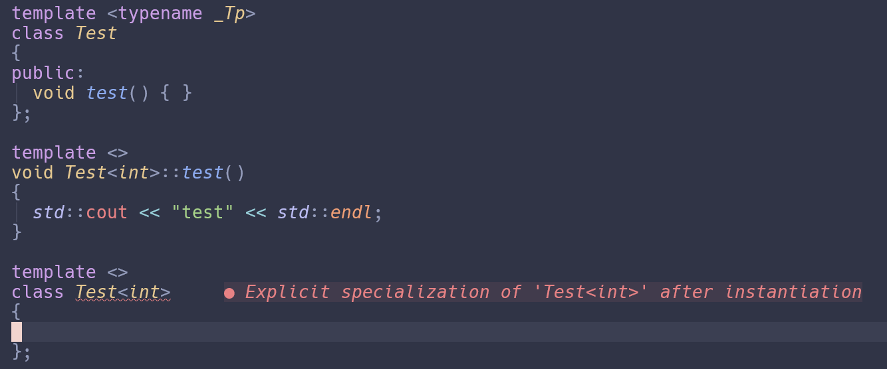

# 2.类模板

## 2.1.实现类模板`stack`

使用`std::vector`作为适配器，包装对应接口

```cpp
template <typename T>
class Stack
{
private:
  std::vector<T> elems; // elements
  // ...
};
```

### 2.1.1.声明类模板

类似函数模板，必须将一个或多个标识符声明为模板参数，`T`仍作为惯用标识符，关键字`typename`也可使用`class`替代

```cpp
template <typename T>
class Stack;
```

在模板内部，`T`可以像其他类型一样被用来声明成员和成员函数，例如此处用于成员函数的参数或者返回值

```cpp
template <typename T>
class Stack
{
private:
  std::vector<T> elems; // elements

public:
  void push(T const &elem); // push element
  void pop();               // pop element
  T const &top() const;     // return top element
  bool empty() const
  { // return whether the stack is empty
      return elems.empty();
  }
};
```

该类的类型为`Stack<T>`，只要是在使用该类类型，就必须使用它进行声明，除非进行类型推导(比如从另外一个类型的`Stack<U>`转换到`Stack<T>`)，在类内部使用类名，表示类的模板实参与模板参数一致

```cpp
template <typename T>
class Stack
{
  Stack(const Stack&);
  Stack& operator=(const Stack&);
  
  // same as
  Stack(const Stack<T>&);
  Stack<T> operator=(const Stack<T>&);
};
```

可以注意到，需要类名的地方，只能使用Stack，如上文的拷贝构造函数

> [!NOTE]
> 与普通类不同的是，不能在块作用域或者函数内部定义类模板，类模板只能在全局/命名空间或类声明内部

### 2.1.2.实现成员函数

对于成员函数empty，其非常简短故定义于类内，让编译器自动内联

```cpp
template <typename T>
class Stack
{
  // ...
public:
  // ...
  bool empty() const
  { // return whether the stack is empty
      return elems.empty();
  }
};
```

其余函数类外定义，在类外定义成员函数需要显式指定是`Stack<T>`的成员函数，将`std::vector`作为适配器，整体实现并不复杂，不做过多解释

需要注意的是，pop函数返回值为void，并未返回刚刚弹出栈的元素，这涉及到一个异常安全的问题

```cpp
template <typename T>
void Stack<T>::push(T const &elem)
{
  elems.push_back(elem); // append copy of passed elem
}

template <typename T>
void Stack<T>::pop()
{
  assert(!elems.empty());
  elems.pop_back(); // remove last element
}

template <typename T>
T const &Stack<T>::top() const
{
  assert(!elems.empty());
  return elems.back(); // return copy of last element
}
```

## 2.2.使用类模板`Stack`

before C++17，在使用类模板时必须提供每个实参

since C++17，若模板参数可以从构造函数导出，则可以不给定实参直接跳过(*class template argument deduction - [CTAD](https://en.cppreference.com/w/cpp/language/class_template_argument_deduction)*)

```cpp
int main()
{
  Stack<int>         intStack;       // stack of ints
  Stack<std::string> stringStack;    // stack of strings

  // manipulate int stack
  intStack.push(7);
  std::cout << intStack.top() << '\n';

  // manipulate string stack
  stringStack.push("hello");
  std::cout << stringStack.top() << '\n';
  stringStack.pop();
}
```

上述代码中`int`和`std::string`作为模板实参，`Stack<int>`和`Stack<std::string>`分别使用`std::vector<int>`和`std::vector<std::string>`作为适配器

> [!NOTE]
> 代码只会对使用过的成员函数进行实例化，并且允许部分使用模板，因此`Stack<int>`比`Stack<std::string>`少实例化成员函数`pop`，*对于类模板的静态成员会对每个类型进行实例化*

可以像使用其他类型一样使用实例化的类模板类型

cv限定，引用类型，复合类型，别名声明

```cpp
void foo(Stack<int> const& s)
// parameter s is int stack(cv-qualified lval-reference)
{
  // alias
  using IntStack = Stack<int>;
  
  // compound
  Stack<int> istack[10];
  IntStack istack2[10];
}
```

作为其他模板的实参

```cpp
// as argument of other templates
Stack<Stack<int>> intStackStack; // stack of stack of ints
```

before C++11，`>>`是非法的，since C++11该问题已经被hack

## 2.3.部分使用类模板`Stack`

类模板通常会对它的模板实参应用多种操作，如构造和析构，这或许让我们觉得模板实参必须保证所有操作都是支持的，事实上模板实参仅要保证必要操作即可

例如输出`Stack`类模板持有的所有元素，未受`operator<<`支持的类型不使用该成员函数`printOn`代码就不会出错，但仍然可以使用其他成员函数

```cpp
template <typename T>
void Stack<T>::printOn(std::ostream& strm) const
{
  for (const T& elem : elems)
    strm << elem << ' ';
}
```

### 2.3.1.`concepts`(概念)

如何约束模板需要满足哪些条件才能实例化？比如约束类型支持默认构造

- 静态断言，功能简单缺乏类型推导

```cpp
template <typename T>
class C
{
  static_assert(std::is_default_constructible<T>::value);
};
```

- SFINAE，复杂type_traits和晦涩的语法

```cpp
template <typename T,
          typename = std::enable_if_t<std::is_default_constructible_v<T>>>
class C
{ /* ... */ };
```

- 概念与约束：良好的错误诊断与代码风格，C++20带来的福音

```cpp
template <typename T>
requires std::default_initializable
class C
{ /* ... */ };
```

## 2.4.友元

2.3节，为类模板`Stack`实现了一个打印的成员函数，不如实现`operator<<`，通常其为友元函数

```cpp
template <typename T>
class Stack
{
public:
  friend std::ostream& operator<<(std::ostream& strm, const Stack& s)
  {
    s.printOn(strm);
    return strm;
  }
  // ...
};
```

> [!NOTE]
> `Stack<>`的`operator<<`，并不是一个函数模板，而是一个在被使用时伴随模板类实例化生成的“普通”函数
---
> [!IMPORTANT]
> 这里是***声明并定义友元函数***，与下文***声明，稍后实现友元函数***不同

如果要先声明友元函数，稍后再进行实现，则会有些复杂

- 隐式声明一个新的函数模板，但要使用不同的模板参数

```cpp
template<typename T>
class Stack
{
  // ...
  template<typename U>
  friend std::ostream& operator<<(std::ostream&, Stack<U> const&);
};
```

- 将为`Stack<T>`编写的`operator<<`前向声明为函数模板，这同时意味着我们要前向声明类模板，在声明友元时需要使用`<>`表明是函数模板

```cpp
// forward declarations
template<typename T>
class Stack;
template<typename T>
std::ostream& operator<<(std::ostream&, Stack<T> const&);

template<typename T>
class Stack
{
  // ...
  friend std::ostream& operator<< <T>(std::ostream&, Stack<T> const&);
  
  // equal to
  // note: (if this is not what you intended,
  // make sure the function template has already been declared
  // and add '<>' after the function name here)
  friend std::ostream& operator<< <>(std::ostream&, Stack const&);
};
```

这节友元好混乱，原书描述更是抽象，后面仍有章节专门讲述友元，或许不必担心

## 2.5.类模板特化

类模板特化允许特定类型的实现，或者为模板实例化修复特定类型的错误行为

如果特化模板类则必须特化所有成员函数，虽然也可以只特化某些成员，但这样做会带来不再可以特化该类型的类模板的后果



> [!NOTE]
> 只特化部分成员函数要有`template <>`(***指定特定类型类模板实例的成员函数***)，特化的类模板外实现成员函数不需要(“***“普通的”函数***”)
---
> [!TIP]
> 或者简单点说，前者类模板未特化，后者类模板已经特化

以前节`Stack`类模板为例

```cpp
template <>
class Stack<std::string>
{ /* ... */ };
```

对于这些特化,***成员函数的定义必须是一个“普通的”成员函数***，类外定义：

```cpp
void Stack<std::string>::push(std::string const& elem)
{
  elems.push_back(elem); // append copy of passed elem
}
```

类内定义仍正常：

```cpp
template <>
class Stack<std::string>
{
private:
  std::deque<std::string> elems; // elements
public:
  void push(std::string const &); // push element
  void pop();                     // pop element
  std::string const &top() const; // return top element
  bool empty() const
  { // return whether the stack is empty
      return elems.empty();
  }
};

void Stack<std::string>::push(std::string const& elem)
{
  elems.push_back(elem); // append copy of passed elem
}

void Stack<std::string>::pop()
{
  assert(!elems.empty());
  elems.pop_back(); // remove last element
}

std::string const &Stack<std::string>::top() const
{
  assert(!elems.empty());
  return elems.back(); // return copy of last element
}
```

## 2.6.偏特化

```cpp
template <typename T>
class Stack<T*>
{
private:
  std::vector<T*> elems;
public:
  // ...
}
```

这个偏特化的类模板处理了所有裸指针的情形

多个参数的偏特化

```cpp
template <typename T1, typename T2>
class MyClass { /* ... */ };

template <typename T>
class MyClass<T, T> { /* ... */ };

template <typename T>
class MyClass<T, int> { /* ... */ };

template <typename T1, typename T2>
class MyClass<T1*, T2*> { /* ... */ };

MyClass<int,float> mif; // uses MyClass<T1,T2>
MyClass<float,float> mff; // uses MyClass<T,T>
MyClass<float,int> mfi; // uses MyClass<T,int>
MyClass<int*,float*> mp; // uses MyClass<T1*,T2*>
```

多个特化匹配则会有歧义

```cpp
MyClass<int, int> m1;   // match MyClass<T, T> and MyClass<T, int>
MyClass<int*, int*> m2; // match MyClass<T, T> and MyClass<T1*, T2*>
```

对于第二个歧义例子可以特化`MyClass<T*, T*>`来解决歧义

## 2.7.类模板默认参数

可以为`Stack<>`模板设置第二个模板参数用来指定容器适配器

```cpp
template <typename T, typename Container = std::vector<T>>
class Stack
{
private:
  Container elems;
  // ...
};
```

这样一来，类外实现成员函数是就要多指定一个模板参数

```cpp
template <typename T, typename Container>
void Stack<T, Container>::push(const T& elem)
{
  elems.push_back(elem);
}
```

更改容器适配器

```cpp
Stack<double, std::deque<double>> s;
```

## 2.8.类型别名(alias)

typedef

```cpp
typedef Stack<int> IntStack;
```

since C++11, keyword using

```cpp
using IntStack = Stack<int>;
```

别名模板，仅using

```cpp
template <typename T>
using DequeStack = Stack<T, std::deque<T>>;
```

成员类型的别名模板

```cpp
template <typename _Tp>
struct remove_const
{ using type = _Tp; };

template <typename _Tp>
struct remove_const<const _Tp>
{ using type = _Tp; };

template <typename _Tp>
using remove_const_t = typename remove_const<_Tp>::type;
```

这样就不必`typename remove_const<>::type`而直接`remove_const_t<>`

## 2.9.模板实参推导(CTAD)

C++17前，必须将所有模板参数类型传递给类模板(除非有默认值)。

C++17 后，指定模板参数的约束放宽了。若构造函数能够推导出所有模板参数 (没有默认值),则可以不用显式定义模板参数

- 使用拷贝构造推导

```cpp
Stack<int> s1;
Stack s2 = s1;
```

- 使用带参数的构造函数推导

```cpp
template <typename T>
class Stack
{
private:
  std::vector<T> elems;

public:
  Stack() = default;

  // will delete default constructor
  // Stack() = default; let the compiler generate it
  Stack(const T& elem)
  : elems({elem}) { }
  
  // ...
};

Stack s = 0; // Stack<int>
```

> [!NOTE]
> 与函数模板不同,类模板参数不能只推导部分参数(通过显式地只指定部分模板参数)

- 字符串字面量推导类模板实参

```cpp
// Stack(const T&)
Stack s = "test";
```

根据构造函数参数`const T&`，此处通过模板实参推导会推导为`Stack<char[5]>`，按引用推导类型不会`decay`

很明显，这是不可取的，因为字符串的长度各不相同，所以按照值推导进行`decay`

```cpp
// Stack(T)
Stack s = "test"; // Stack<const char*>
```

- 推导指引(deduction guide)

  接上文，容器如果要处理指针，这将是非常棘手的，应该禁止容器类模板推导出指针实参

  更好的做法是对该推导进行修复，直接进行从指针到如标准库类型`std::string`的推导

```cpp
Stack(const char*) -> Stack<std::string>
```

> [!NOTE]
> 该指引必须和类定义处在相同作用域

至此模板实参推导已经按照期望正常推导

```cpp
Stack s{"test"}; // Stack<std::string>
```

但是如果使用=进行初始化会有些不同

```cpp
Stack s1 = "test"; // ERROR
Stack s2 = {"test"}; // OK
```

> `error: conversion from 'const char [5]' to non-scalar type 'Stack<std::string>' requested`

第一行实际上是复制初始化，根据cppreference，复制初始化中的隐式转换必须从初始化器直接生成T并且要求非explicit

请求从`const char[5]`向`Stack<std::string>`的复制构造，但是要先从`const char[5]`转换构造出一个`std::string`然后再交由`Stack<std::string>`，必须直接得到`Stack<std::string>`，这显然是不可能的

```cpp
Stack s = "test"s; // OK
```

而第二行事实上是复制列表初始化，复制列表初始化（考虑explicit和非explicit构造函数，但只能调用非explicit构造函数）

- [初始化](https://en.cppreference.com/w/cpp/language/initialization)

- [复制初始化](https://en.cppreference.com/w/cpp/language/copy_initialization)

- [列表初始化](https://en.cppreference.com/w/cpp/language/list_initialization)

对于拷贝操作，没有上面这种奇怪的行为，也没有推导成`Stack<Stack<std::string>>`

> 当从类模板的某个特化类型的单个实参进行的初始化有问题时，通常与默认的包装相比，更偏好复制推导 --cppreference

```cpp
Stack stack2{stringStack}; // Stack<std::string> deduced
Stack stack3(stringStack); // Stack<std::string> deduced
Stack stack4 = {stringStack}; // Stack<std::string> deduced
```

这节已经脱离主题了，原书这里很奇怪提了复制初始化但是没有对应的解释，让人费解

## 2.10.模板化的聚合类型

[聚合体](https://zh.cppreference.com/w/cpp/language/aggregate_initialization)

一个例子：

```cpp
template <typename T>
class ValueWithComment
{
  T value;
  std::string comment;
};

ValueWithComment<int> vc;
vc.value = 42;
vc.comment = "initial value";
```

C++17之后，甚至可以为模板化的聚合类型定义推导指引

```cpp
ValueWithComment(const char*, const char*) -> ValueWithComment<std::string>;

ValueWithComment vc2 = {"hello", "initial value"};
```

有关C++20的补充例(cppreference)：

```cpp
template<class A, class B>
struct Agg
{
    A a;
    B b;
};
// implicitly-generated guides are formed from default, copy, and move constructors
 
template<class A, class B>
Agg(A a, B b) -> Agg<A, B>;
// This deduction guide can be implicitly generated in C++20
```

来自标准库的例子(要求`array`至少拥有一个元素并且后继元素类型均与第一个相同)：

```cpp
template <typename _Tp, typename... _Up>
array(_Tp, _Up...) ->
  array<std::enable_if_t<(std::is_same_v<_Tp, _Up> && ...), _Tp>,
  1 + sizeof...(_Up)>
```
