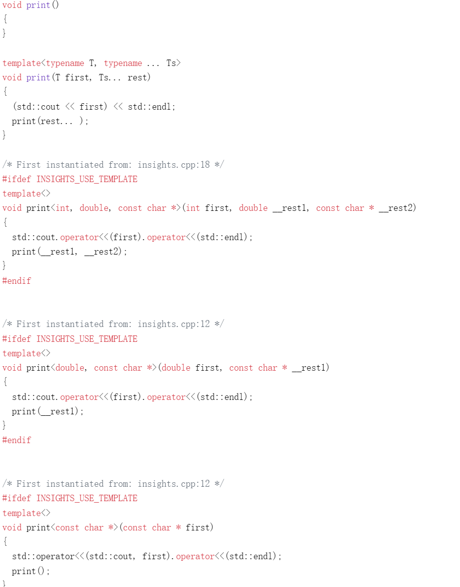

# 4.可变参数模板

## 4.1.definition

接受任意类型，任意数量模板参数的模板

### 4.1.1.可变参数模板示例

```cpp
void print()
{
  
}

template <typename T, typename... Ts>
void print(T first, Ts... rest)
{
  std::cout << first << std::endl;
  print(rest...);
}

int main(int argc, char **argv)
{
  print(1, 2.0, "hello world");

  return 0;
}
```

因为函数模板print只能处理参数列表非空的情形，我们需要手动提供空包时的重载



### 4.1.2.重载可变和非可变模板

上节示例也可如下实现：

```cpp
template <typename T>
void print(T arg)
{
  std::cout << arg << std::endl;
}

template <typename T, typename... Ts>
void print(T first, Ts... rest)
{
  print(first);
  print(rest...);
}
```

补充（优先匹配无尾形参包的函数模板）：
> the function template without the trailing parameter pack is preferred.<br>
> Initially, in C++11 and C++14 this was an ambiguity, which was fixed later (see [CoreIssue1395]), but all compilers handle it this way in all versions.

### 4.1.3.`operator sizeof...`

C++11 还为可变参模板引入了一种新的操作符：`sizeof...`，其值为参数包包含的元素数量，模板参数参数包和函数形参包均可应用`sizeof...`

```cpp
template <typename T, typename... Ts>
void print(T first, Ts... rest)
{
  std::cout << sizeof...(Ts) << std::endl;
  std::cout << sizeof...(rest) << std::endl;
  ...
}
```

`print`另一种方式，要求C++17 `if constexpr`

```cpp
template <typename T, typename... Ts>
void print(T first, Ts... rest)
{
  std::cout << first << std::endl;
  if constexpr (sizeof...(rest) > 0)
    print(rest...);
}
```

## 4.2.折叠表达式

Since C++17，新特性折叠表达式可以对参数包中的所有元素应用二元运算符

```cpp
template <typename Ts>
auto foldSum(Ts... args)
{
  return (... + args); // ((arg1 + arg2) + arg3) + ...
}
```

若参数包为空，表达式通常是错误格式的(除了操作符`&&`的值为`true`,操作符`||`的值为`false`, 逗号操作符空参数包的值为`void()`)

| Fold Expression | Evaluation |
|---|---|
| *( ... op pack )* | *((( pack1 op pack2 ) op pack3 ) ... op packN )* |
| *( pack op ... )* | *( pack1 op ( ... ( packN-1 op packN )))* |
| *( init op ... op pack )* | *((( init op pack1 ) op pack2 ) ... op packN )* |
| *( pack op ... op init )* | *( pack1 op ( ... ( packN op init )))* |

一个特别的例子（成员指针）：

```cpp
// define binary tree structure and traverse helpers:
struct Node {
  int value;
  Node* left;
  Node* right;
  Node(int i=0) : value(i), left(nullptr), right(nullptr) {
  }
  //...
};
auto left = &Node::left;
auto right = &Node::right;

// traverse tree, using fold expression:
template<typename T, typename... TP>
Node* traverse (T np, TP... paths) {
  return (np ->* ... ->* paths);      // np ->* paths1 ->* paths2 ...
}

int main()
{
  // init binary tree structure:
  Node* root = new Node{0};
  root->left = new Node{1};
  root->left->right = new Node{2};
  //...
  // traverse binary tree:
  Node* node = traverse(root, left, right);
  //...
}
```

对前节`print`应用折叠表达式

```cpp
template <typename... Ts>
void print(Ts... args)
{
  (std::cout << ... << args) << std::endl;
}
```

这样输出，参数间没有空格

```cpp
template <typename T>
class AddSpace
{
public:
  AddSpace(const T& t) : arg(t) { }

  friend std::ostream& operator<<(std::ostream& os, const AddSpace& a)
  {
    return os << a.arg << ' ';
  }
private:
  const T& arg;
};

template <typename... Ts>
void print(Ts... args)
{
  (std::cout << ... << AddSpace(args)) << std::endl;
}
```

这样输出间便有了空格

## 4.3.可变参数模板的应用

- `std::make_shared`

```cpp
template<typename T, typename... Args>
shared_ptr<T> make_shared(Args&&... args);
```

- `std::thread`

```cpp
class thread
{
public:
  template<typename F, typename... Args>
  explicit thread(F&& f, Args&&... args);
  // ...
};
```

- `std::vector<_Tp>::emplace_back`

```cpp
template<typename T, typename Allocator = allocator<T>>
class vector
{
public:
  template<typename... Args>
  reference emplace_back(Args&&... args);
  // ...
};
```

可变参数推导规则与一般模板参数推导一致

## 4.4.可变参数类模板及其表达式

形参包可以出现在其他地方，如表达式、类模板、using声明，甚至是推导指引

> ps：这不是很正常吗，原书大呼小叫的

### 4.4.1.表达式

- printDouble，累加形参包每个元素

```cpp
template <typename T>
void print(const T& arg)
{
  std::cout << arg << std::endl;
}

template <typename T, typename... Ts>
void print(const T& arg, const Ts&... args)
{
  print(arg);
  print(args...);
}

template <typename... Ts>
void printDouble(const Ts&... args)
{
  print((args + args)...);
}

int main(int argc, char **argv)
{
  printDouble(1, 2.0, std::string("hello world"));

  return 0;
}
```

- 对形参包中的元素每个加一

```cpp
template <typename... Ts>
void addOne(const Ts&... args)
{
  print((args + 1)...);
}
```

- 判断形参包参数类型是否全部一致

```cpp
template <typename T, typename... Ts>
constexpr bool isHomogeneous(T, Ts...)
{
  return (std::is_same<T, Ts>::value && ...);
}
```

### 4.4.2.可变参数索引

```cpp
template <typename Container, typename... Idx>
void printElems(const Container& c, Idx... idx)
{
  print(c[idx]...);
}
```

```cpp
// in main
  printElems(std::vector{1, 2, 3}, 1, 0, 2);
```

在模板实参指定索引，前置索引形参包即可

```cpp
template <std::size_t...idx, typename Container>
void printElems(const Container& c)
{
  print(c[idx]...);
}

int main(int argc, char **argv)
{
  printElems<2, 0, 1>(std::vector{1, 2, 3});

  return 0;
}
```

### 4.4.3.可变参数类模板

- std::tuple

```cpp
template <typename... _Elements>
class tuple { /* ... */ };
```

- std::variant

```cpp
template <typename... _Types>
class variant { /* ... */ }; 
```

- integer_sequence

```cpp
template <typename _Tp, _Tp... _Idx>
struct integer_sequence { /* ... */ };
```

使用示例：

```cpp
template <typename _Tuple_like, std::size_t... _Idx>
void printById(_Tuple_like t, std::index_sequence<_Idx...>)
{
  print(std::get<_Idx>(t)...);
}

int main(int argc, char **argv)
{
  printById(std::tuple{1, 2.0}, std::index_sequence<1, 0>{ });

  return 0;
}
```

一般来说满足概念`tuple_like`都可以使用`index_sequence`和`std::get`按索引访问

### 4.4.4.可变参数的推导指引

[第二章最后array的推导指引](https://github.com/butterswings/templates/blob/main/docs/section1/2-class_templates/class_templates.md#210%E6%A8%A1%E6%9D%BF%E5%8C%96%E7%9A%84%E8%81%9A%E5%90%88%E7%B1%BB%E5%9E%8B)

### 4.4.5.可变参数基类和using

通过mixin（一种C++独有的设计模式），模板类继承其所有的模板参数，公用重载集

```cpp
class Customer
{
  private:
    std::string name;
  public:
    Customer(std::string const& n) : name(n) { }
    std::string getName() const { return name; }
};

struct CustomerEq {
    bool operator() (Customer const& c1, Customer const& c2) const {
      return c1.getName() == c2.getName();
    }
};

struct CustomerHash {
    std::size_t operator() (Customer const& c) const {
      return std::hash<std::string>()(c.getName());
    }
};

// define class that combines operator() for variadic base classes:
template<typename... Bases>
struct Overloader : Bases...
{
    using Bases::operator()...;  // OK since C++17
};

int main()
{
  // combine hasher and equality for customers in one type:
  using CustomerOP = Overloader<CustomerHash,CustomerEq>;

  std::unordered_set<Customer,CustomerHash,CustomerEq> coll1;
  std::unordered_set<Customer,CustomerOP,CustomerOP> coll2;   
  //...
}
```

如上述代码，可以将散列的比较和hash函数对象均置为`CustomerOP`，而不必分别提供
